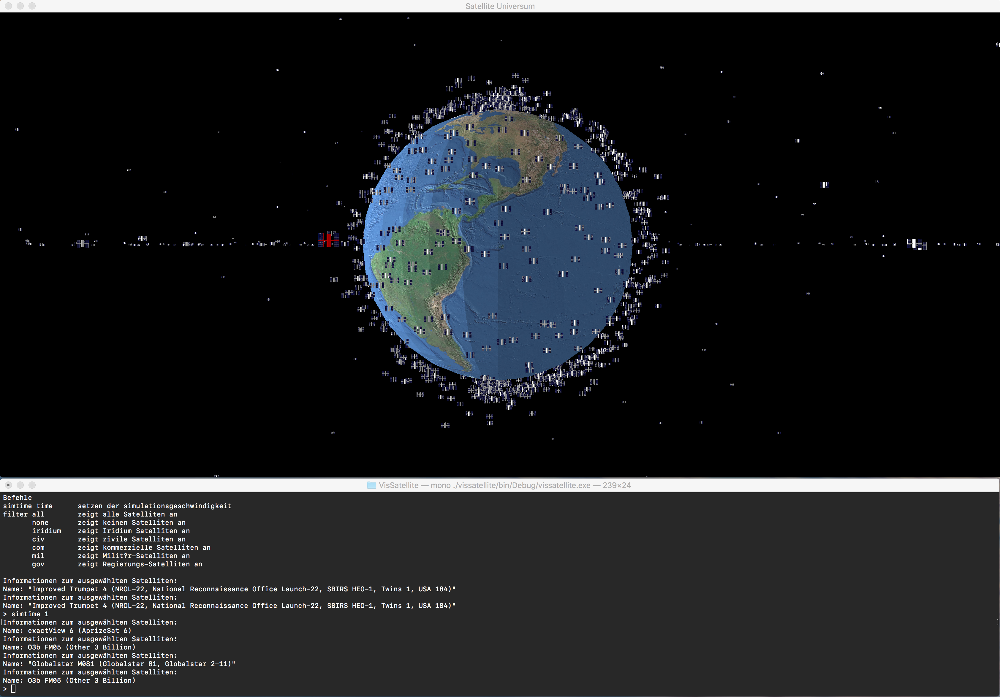
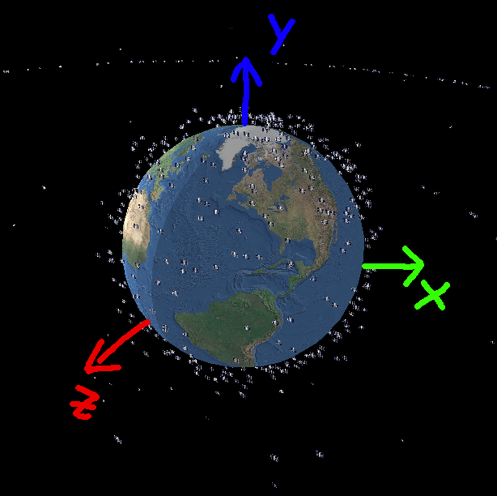

## Project for Visualisierung und HCI class
This application visualizes satellites orbiting earth. The two library in use are the OpenTK library for low level access to OpenGL from C# and ImageSharp for loading the textures. OpenTK is able to run on Windows with the .Net Framework and under Linux or OSX with Mono. The codebase therefor should compile and run without any modifications under all of these operating systems (tested on OS X, Windows and Linux).

### Using the program

On Windows just double click the `vissatellite.exe` and on OS X start it by typing `mono vissatellite.exe` into the Terminal app. Vissatellite makes use of the Console window as well as the GUI. Moving around in space is done in the GUI window. Once focused use `W` and `S` to move forward or backward, `A` and `D`to  move left or right, `Q` and `E` to move up and down, `Arrow Up` and `Arrow Down` to control the Pitch and `Arrow Left` and `Arrow Right` to manipulate the Yaw Axis.

If there is a satellite on your Screen that you want to know more about just select it with a `Left Mouseclick`. Once selected, the color of the satellite changes to red and additional information appears on the Console.

The console window does not only show additional information, it can also be used to manipulate the simulation. The implemented commands are printed to the console at application startup.

### Code
#### Embedded resources
All additional resources that the program needs for execution are part of the assemblies. For each type of resource there is a toplevel directory.

    /meshes
    /shader
    /simdata
    /texture

The `meshes` directory contains Wavefront (.obj) files for all the geometry used. The `shader` directory contains source code for a fragment and vertex shader with very primitive lighting. The `simdata` directory contains a single `.txt` file with all the satellite informations and the `textures` directory contains colortextures as well as a empty normal texture.

#### Source
Five `.cs` files make up the entire source code for this tiny program. 

`Utils.cs` is a small file with two extension methods for working with embedded resources. One for loading the entire resource as string and the other for opening a stream to a embedded resource.

`Program.cs` contains only 2 important lines of code that create a instance of the `SatelliteUniverse` class and execute the `Run` method.

`Wavefront.cs` has a single static class named `Wavefront` with only a single used public method `ObjectVertexData Load(string filename)`. It parses the specified wavefront file, Calculates the Tangents and Bitangents using the uv coordinates and also evaluates the absolute maximum value for all vertices. This is used for creating a bounding sphere for ray picking.

`DataTypes.cs` defines all datatypes on which the main code operates on. This project tries, just for fun, a data oriented design which seperates the data from code. The `GameData` class is the root of all evil and contains all game state. The bulk are loaded assets with their OpenGL handle and the simulation state.

`SatelliteUniverse.cs` is the largest file containing all of the logic. Starting on top with some boilerplate code it continues with the `OnLoad` method that is responsible for loading all assets. This includes pushing these into the GPU memory and storing the handle. Next up is the rendering code that puts one earth to the screen and all the satellites. Following is input processing code with the camera movement and the, in a seperate thread executing, `ProcessConsoleInput` method that takes care of reading and processing commands typed into the console. Some unloading code that first and foremost is probably incomplete, but not really necessary since every GPU should be able to store all assets. The methode `DoSimulation` gets called every frame. The postion of all satellites is calculated based on the elapsed seconds since the application was started and a factor for scaling the simulation speed.

### Simulation
The simulation is based on converting the six keplerian orbit elements to cartesian coordinates at distinct points in time. A simplified (and approximateing) form of the kepler equation is used to calculate 2D polar coordinates in the equatorial (xz) plane first. The polar coordinates are then transformed to 3D cartesian coordinates (with the y-component always beeing zero). In order to account for the inclination and the angle of the ascending node, the 3D caertesian coordinates are rotated around the x-axis by the inclination and around the polar (y) axis by the longitude of the ascending node.

Because the used dataset is missing two of the six requierd elements to fully constrain an orbit, the missing values are generated randomly when the data is loaded. The missing elements are the argument of periapsis and the longitude of the ascending node. Both elements are used to define the orientation of the orbital plane.

